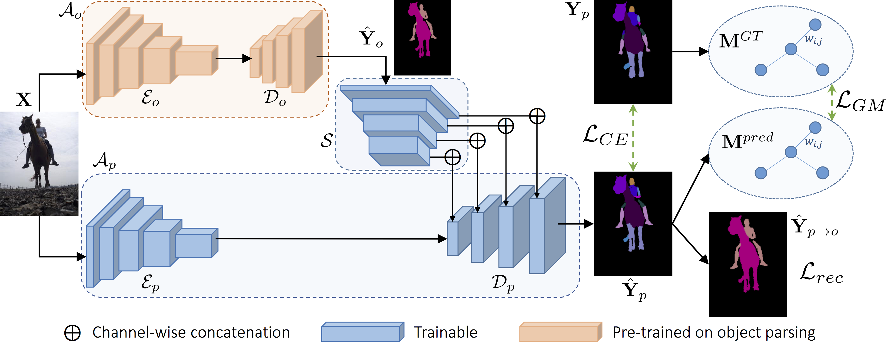
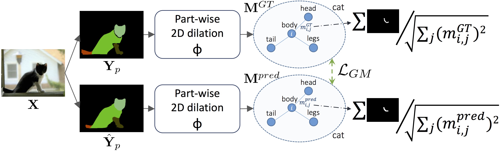

# GMNet: Graph Matching Network for Large Scale Part Semantic Segmentation in the Wild
Official Tensorflow Implementation for "GMNet: Graph Matching Network for Large Scale Part Semantic Segmentation in the Wild", U. Michieli, E. Borsato, L. Rossi, P. Zanuttigh, ECCV 2020

In this work, we propose a novel framework combining higher object-level context conditioning and part-level spatial relationships to address the semantic segmentation of parts of multiple objects. 

To tackle object-level ambiguity, a class-conditioning module is introduced to retain class-level semantics when learning parts-level semantics. 
In this way, mid-level features carry also this information prior to the decoding stage. 

To tackle part-level ambiguity and localization we propose a novel adjacency graph-based module that aims at matching the relative spatial relationships between ground truth and predicted parts. 

The webpage of the paper is [here](https://lttm.dei.unipd.it/paper_data/GMNet/)

The slides and the recordings of the presentation will be available soon.

 
 

# Requirements and Installation

This repository uses Python 3.x and Tensorflow 1.13 (TF 1.10 - 1.15 should work just well)

The code is built upon the official implementation of the [Deeplab architecture](https://github.com/tensorflow/models/tree/master/research/deeplab).
We refer to their [installation guidelines](https://github.com/tensorflow/models/blob/master/research/deeplab/g3doc/installation.md).

In particular remember to export the python path back to (assuming you are in Deeplab/research/deeplab/):
> export PYTHONPATH=$PYTHONPATH:`pwd`:`pwd`/../../../Deeplab

## Download data and checkpoints

In this project we used two datasets: Pascal-Part-58 and Pascal-Part-108.

The datasets and some checkpoints of interest are available [here](https://lttm.dei.unipd.it/paper_data/GMNet/data.zip)

## Generate object-level tfrecords
To generate the tfrecords of the Pascal-VOC2012 with 21 classes:

> python -u build_voc2012_data.py \
--image_folder dataset/RGB \
--semantic_segmentation_folder dataset/label21 \
--list_folder dataset \
--output_dir tfrecord_21_classes

NB: all the paths need to be adjusted properly. 
For information on the flags, see their helper description.

## Generate object-level softmax maps

Then, we generate object-level softmax maps for object-level conditioning while learning parts.
You may use whatever semantic segmentation network pretrained on object-level classes.
The higher the accuracy at the object level and the more effective will result the guidance.

For convenience, we trained a model on the 21 object-level classes of Pascal and we place it in the archive file downloaded earlier.
Given such checkpoint, you need to run an inference pass saving the softmax maps for both train and val splits respectively:

> python -u vis_classes.py \
--logtostderr \
--eval_split train \
--model_variant resnet_v1_101_beta \
--atrous_rates 6 \
--atrous_rates 12 \
--atrous_rates 18 \
--output_stride 16 \
--decoder_output_stride 4 \
--eval_crop_size "513,513" \
--checkpoint_dir TRAIN_21_classes \
--vis_logdir VIS_21_classes \
--dataset pascal_voc_seg \
--dataset_dir tfrecord_21_classes \
--max_number_of_evaluations 1 \
--save_softmax 1 \
1> VIS_21_classes.txt 2>&1 

> python -u vis_classes.py \
--logtostderr \
--eval_split train \
--model_variant resnet_v1_101_beta \
--atrous_rates 6 \
--atrous_rates 12 \
--atrous_rates 18 \
--output_stride 16 \
--decoder_output_stride 4 \
--eval_crop_size "513,513" \
--checkpoint_dir TRAIN_21_classes \
--vis_logdir VIS_21_classes \
--dataset pascal_voc_seg \
--dataset_dir tfrecord_21_classes \
--max_number_of_evaluations 1 \
--save_softmax 1 \
1> VIS_21_classes.txt 2>&1 

## Generate part-level tfrecords
To generate the tfrecords of the Pascal-Part-58 with softmax contained inside:

> python -u build_voc2012_data.py \
--image_folder dataset/RGB \
--semantic_segmentation_folder dataset/label58/gray/all \
--softmax_folder VIS_21_classes/softmax_results \
--load_softmax 1 \
--list_folder dataset \
--output_dir tfrecord_58_parts

## Perform Training

The commands to perform training can be found in the *.job or *.slurm files present in the zip archive downloaded earlier.

For instance, the command to train the complete model (GMNet) on the Pascal-Part-58 is:

> python -u train.py \
--logtostderr \
--train_split train \
--model_variant resnet_v1_101_beta \
--atrous_rates 6 \
--atrous_rates 12 \
--atrous_rates 18 \
--output_stride 16 \
--decoder_output_stride 4 \
--train_crop_size "513,513" \
--base_learning_rate 0.005 \
--train_batch_size 10 \
--training_number_of_steps 50000 \
--dataset pascal_voc_seg_58_parts \
--tf_initial_checkpoint pretrained/imagenet/resnet_v1_101_2018_05_04/model.ckpt \
--train_logdir TRAIN_58_parts \
--dataset_dir tfrecord_58parts_complete \
--model_softmax 1 \
--graph_loss 1 \
--weighted_graph 1 \
--class_dilation_kernel 2 \
--graph_lambda_loss 0.1 \
--graph_loss_type 'mean_squared_error' \
--aux_loss 1 \
--aux_lambda_loss 0.0001 \
1> TRAIN_58_parts.txt 2>&1

## Perform Evaluation and Visualization

The command to evaluate the complete model (GMNet) on the Pascal-Part-58 is:

> python -u eval.py \
--logtostderr \
--eval_split val \
--model_variant resnet_v1_101_beta \
--atrous_rates 6 \
--atrous_rates 12 \
--atrous_rates 18 \
--output_stride 16 \
--decoder_output_stride 4 \
--eval_crop_size "513,513" \
--checkpoint_dir TRAIN_58_parts \
--eval_logdir EVAL_58_parts \
--dataset pascal_voc_seg_58_parts \
--dataset_dir tfrecord_58parts_complete \
--max_number_of_evaluations 1 \
--model_softmax 1 \
1> EVAL_58_parts.txt 2>&1

To visualize the part-level predictions, instead, the command is:

> python -u vis_parts.py \
--logtostderr \
--eval_split val \
--model_variant resnet_v1_101_beta \
--atrous_rates 6 \
--atrous_rates 12 \
--atrous_rates 18 \
--output_stride 16 \
--decoder_output_stride 4 \
--eval_crop_size "513,513" \
--checkpoint_dir TRAIN_58_parts \
--vis_logdir VIS_58_parts \
--dataset pascal_voc_seg_58_parts \
--dataset_dir tfrecord_58parts_softmax \
--max_number_of_evaluations 1 \
--model_softmax 1 \
1> VIS_58_parts.txt 2>&1 

## Cite us
If you use this repository or you find our work useful, please consider to cite:

       @inProceedings{michieli2020gmnet,
       author = {Michieli, Umberto and Borsato, Edoardo and Rossi, Luca and Zanuttigh, Pietro},
       title  = {GMNet: Graph Matching Network for Large Scale Part Semantic Segmentation in the Wild},
       booktitle = {European Conference on Computer Vision (ECCV)},
       year      = {2020},
       month     = {August}
       }

## Acknowledgments

Our code is derived from the [official Tensorflow implementation of the Deeplab v3](https://github.com/tensorflow/models/tree/master/research/deeplab).
Remember to cite also their work if you use this code.

## License

[Apache License 2.0](LICENSE)